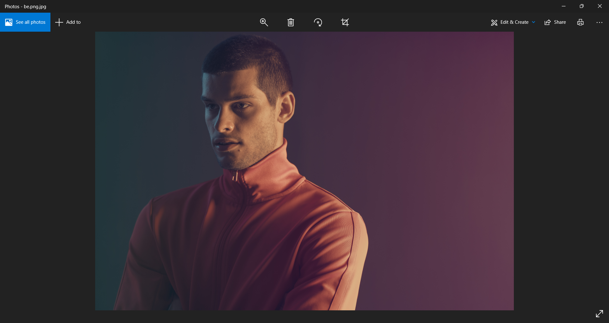
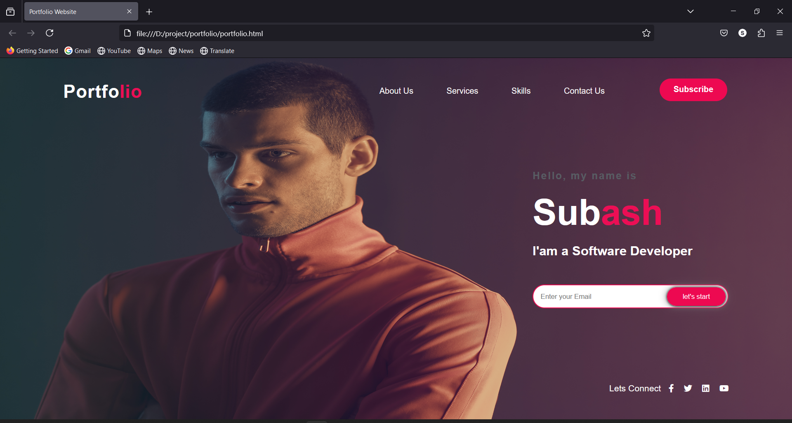

# Portfolio Website using HTML and CSS
  * A responsive personal portfolio website built with **HTML** and **CSS**.

# Features:
  - Clean UI/UX design
  - Responsive layout
  - Sections: About, Skills, Projects,Contact
# Technologies used:
  - HTML
  - CSS
# Screenshots:
 
 

# Future Enhancements:
  - Add JavaScript animations
  - Connect with backend (PHP/Node.js)
# Author
  Subash.S.K
